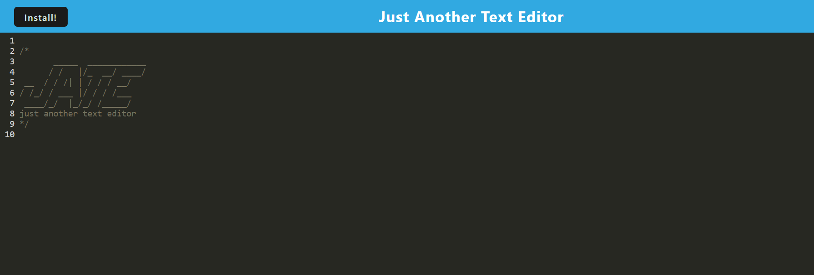

# Text-Editor
 

 

<h3 align="center">Text Editor</h3>

  

    Application for creating and editing text content
     
  

  
Table of Contents

  <ol>
    <li><a href="#about-the-project">About The Project</a></li>
    <li><a href="#tools">Tools</a></li>
    <li><a href="#instructions">Instructions</a></li>
    <li><a href="#usage">Usage</a></li>
    <li><a href="#license">License</a></li>
    <li><a href="#contact">Contact</a></li>
  </ol>

## About The Project

The motivation behind this project is to create an intuitive text editor that can be used both online and offline. 

(<a href="#top">back to top</a>)

### Tools

* JavaScript
* Node.js
* Webpack

(<a href="#top">back to top</a>)

## Instructions

Once you navigate to the deployed application [here](https://henry-text-editor.herokuapp.com/), you are able to type text such as notes in the text editor. Once this is completed, the text is saved in Indexed Database which will be retreived next time you access the application.

You are able to click the install icon in the top left-side of the screen to install the application for offline use. 

(<a href="#top">back to top</a>)

## License

 Distributed under the MIT License. See `LICENSE.txt` for more information.

(<a href="#top">back to top</a>)

## Contact

Henry Nguyen -  hln11244@gmail.com

Repository Link: [https://github.com/henry11244/Text-Editor](https://github.com/henry11244/Text-Editor)

linkedIn: https://www.linkedin.com/in/henry11244/

(<a href="#top">back to top</a>)

